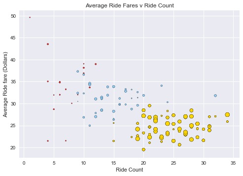
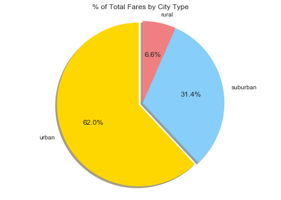

```python
#Observations
#1. Urban Pyber data showed that there were more Pyber drivers per city, lower fare cost per ride and more rides per city than the Suburban and Rural Pyber data.
#2. Suburban Pyber data showed that Suburban Pyber drivers fare costs were slightly higher than Urban Pyber drivers but less than Rural Pyber drivers. On average, there were less Pyber drivers and rides in suburban cities.
#3. Rural Pyber date showed that there were much less Pyber drivers and amount of rides in Rural cities. The date also showed that the ride fare in rural cities varied more than the other city types, this could be that the distance traveled between rural cities is greater than the suburban and urban cities. I also changed the color of the rural data in the scatter plot to red to stand out more.

    
```


```python
import pandas as pd
import numpy as np
import matplotlib.pyplot as plt
import seaborn as sns
```


```python
ride_df = pd.read_csv('ride_data.csv')
city_df = pd.read_csv('city_data.csv')
```


```python
combined_df = pd.merge(ride_df, city_df, how='outer', on='city')
combined_df
```


<div>
<style>
    .dataframe thead tr:only-child th {
        text-align: right;
    }

    .dataframe thead th {
        text-align: left;
    }

    .dataframe tbody tr th {
        vertical-align: top;
    }
</style>
<table border="1" class="dataframe">
  <thead>
    <tr style="text-align: right;">
      <th></th>
      <th>city</th>
      <th>date</th>
      <th>fare</th>
      <th>ride_id</th>
      <th>driver_count</th>
      <th>type</th>
    </tr>
  </thead>
  <tbody>
    <tr>
      <th>0</th>
      <td>Sarabury</td>
      <td>2016-01-16 13:49:27</td>
      <td>38.35</td>
      <td>5403689035038</td>
      <td>46</td>
      <td>Urban</td>
    </tr>
    <tr>
      <th>1</th>
      <td>Sarabury</td>
      <td>2016-07-23 07:42:44</td>
      <td>21.76</td>
      <td>7546681945283</td>
      <td>46</td>
      <td>Urban</td>
    </tr>
    <tr>
      <th>2</th>
      <td>Sarabury</td>
      <td>2016-04-02 04:32:25</td>
      <td>38.03</td>
      <td>4932495851866</td>
      <td>46</td>
      <td>Urban</td>
    </tr>
    <tr>
      <th>3</th>
      <td>Sarabury</td>
      <td>2016-06-23 05:03:41</td>
      <td>26.82</td>
      <td>6711035373406</td>
      <td>46</td>
      <td>Urban</td>
    </tr>
    <tr>
      <th>4</th>
      <td>Sarabury</td>
      <td>2016-09-30 12:48:34</td>
      <td>30.30</td>
      <td>6388737278232</td>
      <td>46</td>
      <td>Urban</td>
    </tr>
    <tr>
      <th>5</th>
      <td>Sarabury</td>
      <td>2016-08-04 00:25:52</td>
      <td>27.20</td>
      <td>2429366407526</td>
      <td>46</td>
      <td>Urban</td>
    </tr>
    <tr>
      <th>6</th>
      <td>Sarabury</td>
      <td>2016-07-25 10:44:01</td>
      <td>17.73</td>
      <td>4467299640441</td>
      <td>46</td>
      <td>Urban</td>
    </tr>
    <tr>
      <th>7</th>
      <td>Sarabury</td>
      <td>2016-06-22 16:24:01</td>
      <td>23.94</td>
      <td>6153395712431</td>
      <td>46</td>
      <td>Urban</td>
    </tr>
    <tr>
      <th>8</th>
      <td>Sarabury</td>
      <td>2016-01-27 17:46:45</td>
      <td>16.39</td>
      <td>8220809448298</td>
      <td>46</td>
      <td>Urban</td>
    </tr>
    <tr>
      <th>9</th>
      <td>Sarabury</td>
      <td>2016-04-26 11:31:30</td>
      <td>21.80</td>
      <td>5969441875705</td>
      <td>46</td>
      <td>Urban</td>
    </tr>
    <tr>
      <th>10</th>
      <td>Sarabury</td>
      <td>2016-08-14 19:56:59</td>
      <td>7.83</td>
      <td>4979570237054</td>
      <td>46</td>
      <td>Urban</td>
    </tr>
    <tr>
      <th>11</th>
      <td>Sarabury</td>
      <td>2016-01-06 03:02:55</td>
      <td>5.19</td>
      <td>9988466326333</td>
      <td>46</td>
      <td>Urban</td>
    </tr>
    <tr>
      <th>12</th>
      <td>Sarabury</td>
      <td>2016-03-29 15:47:35</td>
      <td>17.00</td>
      <td>3574423871181</td>
      <td>46</td>
      <td>Urban</td>
    </tr>
    <tr>
      <th>13</th>
      <td>Sarabury</td>
      <td>2016-11-20 11:44:23</td>
      <td>28.47</td>
      <td>3793266633941</td>
      <td>46</td>
      <td>Urban</td>
    </tr>
    <tr>
      <th>14</th>
      <td>Sarabury</td>
      <td>2016-07-17 20:41:06</td>
      <td>17.79</td>
      <td>9661023488490</td>
      <td>46</td>
      <td>Urban</td>
    </tr>
    <tr>
      <th>15</th>
      <td>Sarabury</td>
      <td>2016-11-06 02:23:59</td>
      <td>19.48</td>
      <td>7305651789766</td>
      <td>46</td>
      <td>Urban</td>
    </tr>
    <tr>
      <th>16</th>
      <td>Sarabury</td>
      <td>2016-09-26 07:30:31</td>
      <td>26.71</td>
      <td>6310253827816</td>
      <td>46</td>
      <td>Urban</td>
    </tr>
    <tr>
      <th>17</th>
      <td>Sarabury</td>
      <td>2016-06-04 20:50:52</td>
      <td>14.19</td>
      <td>8765571028809</td>
      <td>46</td>
      <td>Urban</td>
    </tr>
    <tr>
      <th>18</th>
      <td>Sarabury</td>
      <td>2016-01-22 23:12:06</td>
      <td>38.40</td>
      <td>1176229756048</td>
      <td>46</td>
      <td>Urban</td>
    </tr>
    <tr>
      <th>19</th>
      <td>Sarabury</td>
      <td>2016-03-29 19:07:55</td>
      <td>20.56</td>
      <td>7019491956393</td>
      <td>46</td>
      <td>Urban</td>
    </tr>
    <tr>
      <th>20</th>
      <td>Sarabury</td>
      <td>2016-10-18 04:33:23</td>
      <td>37.50</td>
      <td>1054393799736</td>
      <td>46</td>
      <td>Urban</td>
    </tr>
    <tr>
      <th>21</th>
      <td>Sarabury</td>
      <td>2016-09-30 20:41:18</td>
      <td>44.32</td>
      <td>2103508227691</td>
      <td>46</td>
      <td>Urban</td>
    </tr>
    <tr>
      <th>22</th>
      <td>Sarabury</td>
      <td>2016-07-30 10:37:38</td>
      <td>25.99</td>
      <td>5233926699781</td>
      <td>46</td>
      <td>Urban</td>
    </tr>
    <tr>
      <th>23</th>
      <td>Sarabury</td>
      <td>2016-04-01 07:15:24</td>
      <td>6.94</td>
      <td>1931215121299</td>
      <td>46</td>
      <td>Urban</td>
    </tr>
    <tr>
      <th>24</th>
      <td>Sarabury</td>
      <td>2016-11-23 03:08:59</td>
      <td>37.17</td>
      <td>9141412183460</td>
      <td>46</td>
      <td>Urban</td>
    </tr>
    <tr>
      <th>25</th>
      <td>Sarabury</td>
      <td>2016-10-23 02:40:28</td>
      <td>17.23</td>
      <td>1977978528067</td>
      <td>46</td>
      <td>Urban</td>
    </tr>
    <tr>
      <th>26</th>
      <td>Sarabury</td>
      <td>2016-04-06 21:02:54</td>
      <td>7.14</td>
      <td>6096364843852</td>
      <td>46</td>
      <td>Urban</td>
    </tr>
    <tr>
      <th>27</th>
      <td>South Roy</td>
      <td>2016-01-02 18:42:34</td>
      <td>17.49</td>
      <td>4036272335942</td>
      <td>35</td>
      <td>Urban</td>
    </tr>
    <tr>
      <th>28</th>
      <td>South Roy</td>
      <td>2016-12-03 08:39:02</td>
      <td>32.88</td>
      <td>7098916182845</td>
      <td>35</td>
      <td>Urban</td>
    </tr>
    <tr>
      <th>29</th>
      <td>South Roy</td>
      <td>2016-11-20 02:09:58</td>
      <td>6.81</td>
      <td>6512612750531</td>
      <td>35</td>
      <td>Urban</td>
    </tr>
    <tr>
      <th>...</th>
      <td>...</td>
      <td>...</td>
      <td>...</td>
      <td>...</td>
      <td>...</td>
      <td>...</td>
    </tr>
    <tr>
      <th>2377</th>
      <td>East Leslie</td>
      <td>2016-11-28 09:09:15</td>
      <td>37.76</td>
      <td>804829686137</td>
      <td>9</td>
      <td>Rural</td>
    </tr>
    <tr>
      <th>2378</th>
      <td>East Leslie</td>
      <td>2016-09-08 19:19:38</td>
      <td>30.59</td>
      <td>8211833105097</td>
      <td>9</td>
      <td>Rural</td>
    </tr>
    <tr>
      <th>2379</th>
      <td>East Leslie</td>
      <td>2016-03-02 22:09:34</td>
      <td>36.61</td>
      <td>5500269118478</td>
      <td>9</td>
      <td>Rural</td>
    </tr>
    <tr>
      <th>2380</th>
      <td>East Leslie</td>
      <td>2016-06-22 07:45:30</td>
      <td>34.54</td>
      <td>684950063164</td>
      <td>9</td>
      <td>Rural</td>
    </tr>
    <tr>
      <th>2381</th>
      <td>North Whitney</td>
      <td>2016-04-01 21:21:37</td>
      <td>51.01</td>
      <td>612689673941</td>
      <td>10</td>
      <td>Rural</td>
    </tr>
    <tr>
      <th>2382</th>
      <td>North Whitney</td>
      <td>2016-04-26 09:35:48</td>
      <td>42.09</td>
      <td>9465134041656</td>
      <td>10</td>
      <td>Rural</td>
    </tr>
    <tr>
      <th>2383</th>
      <td>North Whitney</td>
      <td>2016-06-24 21:09:09</td>
      <td>50.03</td>
      <td>9224879345166</td>
      <td>10</td>
      <td>Rural</td>
    </tr>
    <tr>
      <th>2384</th>
      <td>North Whitney</td>
      <td>2016-06-10 18:27:03</td>
      <td>29.25</td>
      <td>4071225680519</td>
      <td>10</td>
      <td>Rural</td>
    </tr>
    <tr>
      <th>2385</th>
      <td>North Whitney</td>
      <td>2016-02-21 18:20:14</td>
      <td>42.01</td>
      <td>3306522110065</td>
      <td>10</td>
      <td>Rural</td>
    </tr>
    <tr>
      <th>2386</th>
      <td>North Whitney</td>
      <td>2016-11-14 10:46:11</td>
      <td>55.07</td>
      <td>8000095653619</td>
      <td>10</td>
      <td>Rural</td>
    </tr>
    <tr>
      <th>2387</th>
      <td>North Whitney</td>
      <td>2016-01-24 09:14:51</td>
      <td>24.37</td>
      <td>7069044920500</td>
      <td>10</td>
      <td>Rural</td>
    </tr>
    <tr>
      <th>2388</th>
      <td>North Whitney</td>
      <td>2016-03-24 10:27:00</td>
      <td>29.72</td>
      <td>3818227780479</td>
      <td>10</td>
      <td>Rural</td>
    </tr>
    <tr>
      <th>2389</th>
      <td>North Whitney</td>
      <td>2016-11-11 16:24:16</td>
      <td>22.99</td>
      <td>3454326063039</td>
      <td>10</td>
      <td>Rural</td>
    </tr>
    <tr>
      <th>2390</th>
      <td>North Whitney</td>
      <td>2016-01-26 01:06:41</td>
      <td>34.92</td>
      <td>4165974278063</td>
      <td>10</td>
      <td>Rural</td>
    </tr>
    <tr>
      <th>2391</th>
      <td>Manuelchester</td>
      <td>2016-03-21 22:15:25</td>
      <td>49.62</td>
      <td>6045427401799</td>
      <td>7</td>
      <td>Rural</td>
    </tr>
    <tr>
      <th>2392</th>
      <td>Shelbyhaven</td>
      <td>2016-05-24 15:29:59</td>
      <td>18.11</td>
      <td>1144791937271</td>
      <td>9</td>
      <td>Rural</td>
    </tr>
    <tr>
      <th>2393</th>
      <td>Shelbyhaven</td>
      <td>2016-10-17 14:47:38</td>
      <td>53.42</td>
      <td>8515375903761</td>
      <td>9</td>
      <td>Rural</td>
    </tr>
    <tr>
      <th>2394</th>
      <td>Shelbyhaven</td>
      <td>2016-04-21 19:22:03</td>
      <td>37.19</td>
      <td>5142074323359</td>
      <td>9</td>
      <td>Rural</td>
    </tr>
    <tr>
      <th>2395</th>
      <td>Shelbyhaven</td>
      <td>2016-06-12 16:57:25</td>
      <td>30.18</td>
      <td>2015025942653</td>
      <td>9</td>
      <td>Rural</td>
    </tr>
    <tr>
      <th>2396</th>
      <td>Shelbyhaven</td>
      <td>2016-07-22 05:59:01</td>
      <td>10.64</td>
      <td>1406024986969</td>
      <td>9</td>
      <td>Rural</td>
    </tr>
    <tr>
      <th>2397</th>
      <td>Shelbyhaven</td>
      <td>2016-01-25 01:39:16</td>
      <td>59.43</td>
      <td>8088329954312</td>
      <td>9</td>
      <td>Rural</td>
    </tr>
    <tr>
      <th>2398</th>
      <td>South Elizabethmouth</td>
      <td>2016-04-03 11:13:07</td>
      <td>22.79</td>
      <td>8193837300497</td>
      <td>3</td>
      <td>Rural</td>
    </tr>
    <tr>
      <th>2399</th>
      <td>South Elizabethmouth</td>
      <td>2016-03-11 12:27:01</td>
      <td>26.72</td>
      <td>4943246873754</td>
      <td>3</td>
      <td>Rural</td>
    </tr>
    <tr>
      <th>2400</th>
      <td>South Elizabethmouth</td>
      <td>2016-11-23 07:47:18</td>
      <td>46.39</td>
      <td>1939838068038</td>
      <td>3</td>
      <td>Rural</td>
    </tr>
    <tr>
      <th>2401</th>
      <td>South Elizabethmouth</td>
      <td>2016-07-19 09:35:59</td>
      <td>31.09</td>
      <td>2959749591417</td>
      <td>3</td>
      <td>Rural</td>
    </tr>
    <tr>
      <th>2402</th>
      <td>South Elizabethmouth</td>
      <td>2016-04-21 10:20:09</td>
      <td>16.50</td>
      <td>5702608059064</td>
      <td>3</td>
      <td>Rural</td>
    </tr>
    <tr>
      <th>2403</th>
      <td>Matthewside</td>
      <td>2016-02-23 17:46:29</td>
      <td>59.65</td>
      <td>241191157535</td>
      <td>4</td>
      <td>Rural</td>
    </tr>
    <tr>
      <th>2404</th>
      <td>Matthewside</td>
      <td>2016-02-23 00:43:51</td>
      <td>40.84</td>
      <td>8665248512368</td>
      <td>4</td>
      <td>Rural</td>
    </tr>
    <tr>
      <th>2405</th>
      <td>Matthewside</td>
      <td>2016-05-18 02:00:30</td>
      <td>48.67</td>
      <td>2049161404256</td>
      <td>4</td>
      <td>Rural</td>
    </tr>
    <tr>
      <th>2406</th>
      <td>Matthewside</td>
      <td>2016-08-08 14:02:35</td>
      <td>24.97</td>
      <td>2872494724827</td>
      <td>4</td>
      <td>Rural</td>
    </tr>
  </tbody>
</table>
<p>2407 rows × 6 columns</p>
</div>


```python
urban = combined_df[combined_df['type'] == 'Urban']
suburban = combined_df[combined_df['type'] == 'Suburban']
rural = combined_df[combined_df['type'] == 'Rural']
```


```python
urban.head()
```


<div>
<style>
    .dataframe thead tr:only-child th {
        text-align: right;
    }

    .dataframe thead th {
        text-align: left;
    }

    .dataframe tbody tr th {
        vertical-align: top;
    }
</style>
<table border="1" class="dataframe">
  <thead>
    <tr style="text-align: right;">
      <th></th>
      <th>city</th>
      <th>date</th>
      <th>fare</th>
      <th>ride_id</th>
      <th>driver_count</th>
      <th>type</th>
    </tr>
  </thead>
  <tbody>
    <tr>
      <th>0</th>
      <td>Sarabury</td>
      <td>2016-01-16 13:49:27</td>
      <td>38.35</td>
      <td>5403689035038</td>
      <td>46</td>
      <td>Urban</td>
    </tr>
    <tr>
      <th>1</th>
      <td>Sarabury</td>
      <td>2016-07-23 07:42:44</td>
      <td>21.76</td>
      <td>7546681945283</td>
      <td>46</td>
      <td>Urban</td>
    </tr>
    <tr>
      <th>2</th>
      <td>Sarabury</td>
      <td>2016-04-02 04:32:25</td>
      <td>38.03</td>
      <td>4932495851866</td>
      <td>46</td>
      <td>Urban</td>
    </tr>
    <tr>
      <th>3</th>
      <td>Sarabury</td>
      <td>2016-06-23 05:03:41</td>
      <td>26.82</td>
      <td>6711035373406</td>
      <td>46</td>
      <td>Urban</td>
    </tr>
    <tr>
      <th>4</th>
      <td>Sarabury</td>
      <td>2016-09-30 12:48:34</td>
      <td>30.30</td>
      <td>6388737278232</td>
      <td>46</td>
      <td>Urban</td>
    </tr>
  </tbody>
</table>
</div>


```python
urban_fare_avg = urban.groupby('city')['fare'].mean()
urban_fare_avg.head()
```


    city
    Alvarezhaven    23.928710
    Alyssaberg      20.609615
    Antoniomouth    23.625000
    Aprilchester    21.981579
    Arnoldview      25.106452
    Name: fare, dtype: float64


```python
urban_fare_avg.head()
```


    city
    Alvarezhaven    23.928710
    Alyssaberg      20.609615
    Antoniomouth    23.625000
    Aprilchester    21.981579
    Arnoldview      25.106452
    Name: fare, dtype: float64


```python
urban_fare_avg_df = pd.DataFrame({"Avg_city": urban_fare_avg})

urban_fare_avg_df.reset_index(inplace=True)
```


```python
urban_fare_avg_df.head()
```


<div>
<style>
    .dataframe thead tr:only-child th {
        text-align: right;
    }

    .dataframe thead th {
        text-align: left;
    }

    .dataframe tbody tr th {
        vertical-align: top;
    }
</style>
<table border="1" class="dataframe">
  <thead>
    <tr style="text-align: right;">
      <th></th>
      <th>city</th>
      <th>Avg_city</th>
    </tr>
  </thead>
  <tbody>
    <tr>
      <th>0</th>
      <td>Alvarezhaven</td>
      <td>23.928710</td>
    </tr>
    <tr>
      <th>1</th>
      <td>Alyssaberg</td>
      <td>20.609615</td>
    </tr>
    <tr>
      <th>2</th>
      <td>Antoniomouth</td>
      <td>23.625000</td>
    </tr>
    <tr>
      <th>3</th>
      <td>Aprilchester</td>
      <td>21.981579</td>
    </tr>
    <tr>
      <th>4</th>
      <td>Arnoldview</td>
      <td>25.106452</td>
    </tr>
  </tbody>
</table>
</div>


```python
urban_total_rides = urban.groupby('city')['ride_id'].nunique()
urban_total_rides.head()
```


    city
    Alvarezhaven    31
    Alyssaberg      26
    Antoniomouth    22
    Aprilchester    19
    Arnoldview      31
    Name: ride_id, dtype: int64


```python
urban_total_rides_df = pd.DataFrame({"Total_rides_city": urban_total_rides})

urban_total_rides_df.reset_index(inplace=True)
```


```python
urban_total_rides_df.head()
```


<div>
<style>
    .dataframe thead tr:only-child th {
        text-align: right;
    }

    .dataframe thead th {
        text-align: left;
    }

    .dataframe tbody tr th {
        vertical-align: top;
    }
</style>
<table border="1" class="dataframe">
  <thead>
    <tr style="text-align: right;">
      <th></th>
      <th>city</th>
      <th>Total_rides_city</th>
    </tr>
  </thead>
  <tbody>
    <tr>
      <th>0</th>
      <td>Alvarezhaven</td>
      <td>31</td>
    </tr>
    <tr>
      <th>1</th>
      <td>Alyssaberg</td>
      <td>26</td>
    </tr>
    <tr>
      <th>2</th>
      <td>Antoniomouth</td>
      <td>22</td>
    </tr>
    <tr>
      <th>3</th>
      <td>Aprilchester</td>
      <td>19</td>
    </tr>
    <tr>
      <th>4</th>
      <td>Arnoldview</td>
      <td>31</td>
    </tr>
  </tbody>
</table>
</div>


```python
urban_total_drivers = urban.groupby('city')['driver_count']
urban_total_drivers_drop = urban.drop_duplicates(subset=['city','driver_count'], keep='last')
urban_total_drivers_drop
```


<div>
<style>
    .dataframe thead tr:only-child th {
        text-align: right;
    }

    .dataframe thead th {
        text-align: left;
    }

    .dataframe tbody tr th {
        vertical-align: top;
    }
</style>
<table border="1" class="dataframe">
  <thead>
    <tr style="text-align: right;">
      <th></th>
      <th>city</th>
      <th>date</th>
      <th>fare</th>
      <th>ride_id</th>
      <th>driver_count</th>
      <th>type</th>
    </tr>
  </thead>
  <tbody>
    <tr>
      <th>26</th>
      <td>Sarabury</td>
      <td>2016-04-06 21:02:54</td>
      <td>7.14</td>
      <td>6096364843852</td>
      <td>46</td>
      <td>Urban</td>
    </tr>
    <tr>
      <th>48</th>
      <td>South Roy</td>
      <td>2016-05-13 04:28:42</td>
      <td>14.85</td>
      <td>7755858811799</td>
      <td>35</td>
      <td>Urban</td>
    </tr>
    <tr>
      <th>67</th>
      <td>Wiseborough</td>
      <td>2016-01-21 15:43:03</td>
      <td>18.28</td>
      <td>9676818789300</td>
      <td>55</td>
      <td>Urban</td>
    </tr>
    <tr>
      <th>93</th>
      <td>Spencertown</td>
      <td>2016-11-22 10:05:47</td>
      <td>4.79</td>
      <td>2729162668443</td>
      <td>68</td>
      <td>Urban</td>
    </tr>
    <tr>
      <th>119</th>
      <td>Nguyenbury</td>
      <td>2016-01-27 07:00:28</td>
      <td>22.38</td>
      <td>7425425924510</td>
      <td>8</td>
      <td>Urban</td>
    </tr>
    <tr>
      <th>144</th>
      <td>New Jeffrey</td>
      <td>2016-09-22 23:52:38</td>
      <td>21.44</td>
      <td>8763732577685</td>
      <td>58</td>
      <td>Urban</td>
    </tr>
    <tr>
      <th>178</th>
      <td>Port Johnstad</td>
      <td>2016-11-01 20:52:15</td>
      <td>41.09</td>
      <td>9067296393743</td>
      <td>22</td>
      <td>Urban</td>
    </tr>
    <tr>
      <th>209</th>
      <td>Jacobfort</td>
      <td>2016-06-04 22:31:57</td>
      <td>37.38</td>
      <td>906007537108</td>
      <td>52</td>
      <td>Urban</td>
    </tr>
    <tr>
      <th>232</th>
      <td>Travisville</td>
      <td>2016-09-25 03:51:39</td>
      <td>39.45</td>
      <td>2448021188839</td>
      <td>37</td>
      <td>Urban</td>
    </tr>
    <tr>
      <th>259</th>
      <td>Sandymouth</td>
      <td>2016-04-25 17:56:42</td>
      <td>23.89</td>
      <td>2912261745379</td>
      <td>11</td>
      <td>Urban</td>
    </tr>
    <tr>
      <th>287</th>
      <td>New Andreamouth</td>
      <td>2016-02-22 18:51:27</td>
      <td>11.92</td>
      <td>5787493616752</td>
      <td>42</td>
      <td>Urban</td>
    </tr>
    <tr>
      <th>309</th>
      <td>New Christine</td>
      <td>2016-07-16 04:10:39</td>
      <td>22.62</td>
      <td>2709317524893</td>
      <td>22</td>
      <td>Urban</td>
    </tr>
    <tr>
      <th>339</th>
      <td>Stewartview</td>
      <td>2016-10-10 06:20:58</td>
      <td>13.90</td>
      <td>4005866140934</td>
      <td>49</td>
      <td>Urban</td>
    </tr>
    <tr>
      <th>362</th>
      <td>Rodriguezburgh</td>
      <td>2016-03-11 11:58:09</td>
      <td>42.88</td>
      <td>9130331181244</td>
      <td>52</td>
      <td>Urban</td>
    </tr>
    <tr>
      <th>380</th>
      <td>West Sydneyhaven</td>
      <td>2016-02-24 06:48:52</td>
      <td>42.96</td>
      <td>52775545231</td>
      <td>70</td>
      <td>Urban</td>
    </tr>
    <tr>
      <th>414</th>
      <td>Swansonbury</td>
      <td>2016-03-24 17:14:54</td>
      <td>7.17</td>
      <td>2321894460533</td>
      <td>64</td>
      <td>Urban</td>
    </tr>
    <tr>
      <th>437</th>
      <td>Lisatown</td>
      <td>2016-08-07 23:07:09</td>
      <td>15.09</td>
      <td>6098402365128</td>
      <td>47</td>
      <td>Urban</td>
    </tr>
    <tr>
      <th>465</th>
      <td>East Erin</td>
      <td>2016-04-30 11:04:53</td>
      <td>9.34</td>
      <td>6037776836315</td>
      <td>43</td>
      <td>Urban</td>
    </tr>
    <tr>
      <th>486</th>
      <td>Port Martinberg</td>
      <td>2016-03-29 02:03:35</td>
      <td>16.00</td>
      <td>2860657960977</td>
      <td>44</td>
      <td>Urban</td>
    </tr>
    <tr>
      <th>513</th>
      <td>Edwardsbury</td>
      <td>2016-07-19 20:04:23</td>
      <td>13.27</td>
      <td>3571086569028</td>
      <td>11</td>
      <td>Urban</td>
    </tr>
    <tr>
      <th>528</th>
      <td>Pamelahaven</td>
      <td>2016-04-23 09:33:27</td>
      <td>37.55</td>
      <td>7632486767202</td>
      <td>30</td>
      <td>Urban</td>
    </tr>
    <tr>
      <th>552</th>
      <td>Fosterside</td>
      <td>2016-12-04 21:31:45</td>
      <td>21.49</td>
      <td>5128740240083</td>
      <td>69</td>
      <td>Urban</td>
    </tr>
    <tr>
      <th>572</th>
      <td>West Alexis</td>
      <td>2016-11-06 19:02:42</td>
      <td>29.01</td>
      <td>4924471900019</td>
      <td>47</td>
      <td>Urban</td>
    </tr>
    <tr>
      <th>601</th>
      <td>Carrollfort</td>
      <td>2016-10-01 04:18:59</td>
      <td>12.76</td>
      <td>2385786307986</td>
      <td>55</td>
      <td>Urban</td>
    </tr>
    <tr>
      <th>629</th>
      <td>New David</td>
      <td>2016-05-25 07:40:52</td>
      <td>24.32</td>
      <td>7741295871755</td>
      <td>31</td>
      <td>Urban</td>
    </tr>
    <tr>
      <th>660</th>
      <td>Williamshire</td>
      <td>2016-10-24 22:12:48</td>
      <td>39.60</td>
      <td>3882385067550</td>
      <td>70</td>
      <td>Urban</td>
    </tr>
    <tr>
      <th>686</th>
      <td>Torresshire</td>
      <td>2016-09-23 14:32:48</td>
      <td>41.20</td>
      <td>4024780961494</td>
      <td>70</td>
      <td>Urban</td>
    </tr>
    <tr>
      <th>708</th>
      <td>New Aaron</td>
      <td>2016-09-30 09:45:03</td>
      <td>35.26</td>
      <td>4769926083028</td>
      <td>60</td>
      <td>Urban</td>
    </tr>
    <tr>
      <th>736</th>
      <td>Kelseyland</td>
      <td>2016-11-26 02:34:57</td>
      <td>15.49</td>
      <td>5187807155760</td>
      <td>63</td>
      <td>Urban</td>
    </tr>
    <tr>
      <th>758</th>
      <td>Lake Sarashire</td>
      <td>2016-05-03 17:43:44</td>
      <td>32.53</td>
      <td>1725233941812</td>
      <td>8</td>
      <td>Urban</td>
    </tr>
    <tr>
      <th>...</th>
      <td>...</td>
      <td>...</td>
      <td>...</td>
      <td>...</td>
      <td>...</td>
      <td>...</td>
    </tr>
    <tr>
      <th>925</th>
      <td>Smithhaven</td>
      <td>2016-09-03 11:34:41</td>
      <td>13.05</td>
      <td>2352819826103</td>
      <td>67</td>
      <td>Urban</td>
    </tr>
    <tr>
      <th>946</th>
      <td>West Jefferyfurt</td>
      <td>2016-02-03 00:54:14</td>
      <td>5.80</td>
      <td>4393925880724</td>
      <td>65</td>
      <td>Urban</td>
    </tr>
    <tr>
      <th>970</th>
      <td>Zimmermanmouth</td>
      <td>2016-10-21 04:10:04</td>
      <td>24.69</td>
      <td>9508846094814</td>
      <td>45</td>
      <td>Urban</td>
    </tr>
    <tr>
      <th>989</th>
      <td>Eriktown</td>
      <td>2016-09-06 07:01:34</td>
      <td>41.11</td>
      <td>8990582387342</td>
      <td>15</td>
      <td>Urban</td>
    </tr>
    <tr>
      <th>1008</th>
      <td>Kellershire</td>
      <td>2016-11-20 16:46:09</td>
      <td>22.01</td>
      <td>4367913867547</td>
      <td>51</td>
      <td>Urban</td>
    </tr>
    <tr>
      <th>1034</th>
      <td>Alyssaberg</td>
      <td>2016-01-08 18:50:12</td>
      <td>17.03</td>
      <td>1841736403845</td>
      <td>67</td>
      <td>Urban</td>
    </tr>
    <tr>
      <th>1059</th>
      <td>Lake Jennaton</td>
      <td>2016-09-03 07:14:23</td>
      <td>8.89</td>
      <td>6023947302499</td>
      <td>65</td>
      <td>Urban</td>
    </tr>
    <tr>
      <th>1089</th>
      <td>West Brandy</td>
      <td>2016-03-23 07:35:25</td>
      <td>38.48</td>
      <td>1506716802765</td>
      <td>12</td>
      <td>Urban</td>
    </tr>
    <tr>
      <th>1118</th>
      <td>West Oscar</td>
      <td>2016-10-26 13:38:35</td>
      <td>9.57</td>
      <td>558835210731</td>
      <td>11</td>
      <td>Urban</td>
    </tr>
    <tr>
      <th>1149</th>
      <td>Arnoldview</td>
      <td>2016-06-08 14:23:20</td>
      <td>33.23</td>
      <td>2561901175214</td>
      <td>41</td>
      <td>Urban</td>
    </tr>
    <tr>
      <th>1181</th>
      <td>South Louis</td>
      <td>2016-11-22 15:34:11</td>
      <td>35.27</td>
      <td>3627438789238</td>
      <td>12</td>
      <td>Urban</td>
    </tr>
    <tr>
      <th>1209</th>
      <td>Lisaville</td>
      <td>2016-01-02 09:04:22</td>
      <td>31.16</td>
      <td>2386664973163</td>
      <td>66</td>
      <td>Urban</td>
    </tr>
    <tr>
      <th>1229</th>
      <td>New Maryport</td>
      <td>2016-07-01 10:14:52</td>
      <td>27.13</td>
      <td>382199011501</td>
      <td>26</td>
      <td>Urban</td>
    </tr>
    <tr>
      <th>1258</th>
      <td>West Dawnfurt</td>
      <td>2016-03-22 00:46:40</td>
      <td>16.97</td>
      <td>9155756590990</td>
      <td>34</td>
      <td>Urban</td>
    </tr>
    <tr>
      <th>1279</th>
      <td>Davidtown</td>
      <td>2016-04-12 21:45:55</td>
      <td>30.19</td>
      <td>9023918750752</td>
      <td>73</td>
      <td>Urban</td>
    </tr>
    <tr>
      <th>1310</th>
      <td>West Peter</td>
      <td>2016-08-25 12:03:53</td>
      <td>41.98</td>
      <td>8601849653888</td>
      <td>61</td>
      <td>Urban</td>
    </tr>
    <tr>
      <th>1333</th>
      <td>Russellport</td>
      <td>2016-10-05 14:04:13</td>
      <td>17.69</td>
      <td>5168390301277</td>
      <td>9</td>
      <td>Urban</td>
    </tr>
    <tr>
      <th>1355</th>
      <td>East Douglas</td>
      <td>2016-08-01 01:21:55</td>
      <td>28.37</td>
      <td>4589100972654</td>
      <td>12</td>
      <td>Urban</td>
    </tr>
    <tr>
      <th>1376</th>
      <td>Mooreview</td>
      <td>2016-07-11 18:46:36</td>
      <td>19.51</td>
      <td>2835637288297</td>
      <td>34</td>
      <td>Urban</td>
    </tr>
    <tr>
      <th>1398</th>
      <td>Port Josephfurt</td>
      <td>2016-09-25 04:47:07</td>
      <td>18.85</td>
      <td>454198708789</td>
      <td>28</td>
      <td>Urban</td>
    </tr>
    <tr>
      <th>1419</th>
      <td>South Bryanstad</td>
      <td>2016-11-16 22:51:16</td>
      <td>13.58</td>
      <td>3696811450171</td>
      <td>73</td>
      <td>Urban</td>
    </tr>
    <tr>
      <th>1443</th>
      <td>Prattfurt</td>
      <td>2016-08-05 20:08:15</td>
      <td>32.12</td>
      <td>4506575381521</td>
      <td>43</td>
      <td>Urban</td>
    </tr>
    <tr>
      <th>1458</th>
      <td>Vickimouth</td>
      <td>2016-05-15 19:26:26</td>
      <td>11.88</td>
      <td>5271795959476</td>
      <td>13</td>
      <td>Urban</td>
    </tr>
    <tr>
      <th>1489</th>
      <td>Alvarezhaven</td>
      <td>2016-07-04 04:28:22</td>
      <td>33.31</td>
      <td>306054352684</td>
      <td>21</td>
      <td>Urban</td>
    </tr>
    <tr>
      <th>1509</th>
      <td>Yolandafurt</td>
      <td>2016-08-04 23:06:32</td>
      <td>36.08</td>
      <td>9895622307900</td>
      <td>7</td>
      <td>Urban</td>
    </tr>
    <tr>
      <th>1533</th>
      <td>West Brittanyton</td>
      <td>2016-07-07 13:33:03</td>
      <td>24.27</td>
      <td>9330634223713</td>
      <td>9</td>
      <td>Urban</td>
    </tr>
    <tr>
      <th>1554</th>
      <td>Maryside</td>
      <td>2016-10-01 05:58:14</td>
      <td>11.20</td>
      <td>763698281945</td>
      <td>20</td>
      <td>Urban</td>
    </tr>
    <tr>
      <th>1576</th>
      <td>Antoniomouth</td>
      <td>2016-03-09 08:07:17</td>
      <td>31.20</td>
      <td>1712057358094</td>
      <td>21</td>
      <td>Urban</td>
    </tr>
    <tr>
      <th>1597</th>
      <td>Lake Stevenbury</td>
      <td>2016-10-03 00:41:32</td>
      <td>14.32</td>
      <td>7741014139517</td>
      <td>63</td>
      <td>Urban</td>
    </tr>
    <tr>
      <th>1624</th>
      <td>Kimberlychester</td>
      <td>2016-11-19 09:53:46</td>
      <td>25.99</td>
      <td>149474167977</td>
      <td>13</td>
      <td>Urban</td>
    </tr>
  </tbody>
</table>
<p>66 rows × 6 columns</p>
</div>


```python
suburban_fare_avg = suburban.groupby('city')['fare'].mean()
suburban_fare_avg.head()
```


    city
    Anitamouth      37.315556
    Campbellport    33.711333
    Carrollbury     36.606000
    Clarkstad       31.051667
    Conwaymouth     34.591818
    Name: fare, dtype: float64


```python
suburban_fare_avg_df = pd.DataFrame({"Avg_city": suburban_fare_avg})

suburban_fare_avg_df.reset_index(inplace=True)
```


```python
suburban_fare_avg_df.head()
```


<div>
<style>
    .dataframe thead tr:only-child th {
        text-align: right;
    }

    .dataframe thead th {
        text-align: left;
    }

    .dataframe tbody tr th {
        vertical-align: top;
    }
</style>
<table border="1" class="dataframe">
  <thead>
    <tr style="text-align: right;">
      <th></th>
      <th>city</th>
      <th>Avg_city</th>
    </tr>
  </thead>
  <tbody>
    <tr>
      <th>0</th>
      <td>Anitamouth</td>
      <td>37.315556</td>
    </tr>
    <tr>
      <th>1</th>
      <td>Campbellport</td>
      <td>33.711333</td>
    </tr>
    <tr>
      <th>2</th>
      <td>Carrollbury</td>
      <td>36.606000</td>
    </tr>
    <tr>
      <th>3</th>
      <td>Clarkstad</td>
      <td>31.051667</td>
    </tr>
    <tr>
      <th>4</th>
      <td>Conwaymouth</td>
      <td>34.591818</td>
    </tr>
  </tbody>
</table>
</div>


```python
suburban_total_rides = suburban.groupby('city')['ride_id'].nunique()
suburban_total_rides.head()
```


    city
    Anitamouth       9
    Campbellport    15
    Carrollbury     10
    Clarkstad       12
    Conwaymouth     11
    Name: ride_id, dtype: int64


```python
suburban_total_rides_df = pd.DataFrame({"Total_rides_city": suburban_total_rides})

suburban_total_rides_df.reset_index(inplace=True)
```


```python
suburban_total_rides_df.head()
```


<div>
<style>
    .dataframe thead tr:only-child th {
        text-align: right;
    }

    .dataframe thead th {
        text-align: left;
    }

    .dataframe tbody tr th {
        vertical-align: top;
    }
</style>
<table border="1" class="dataframe">
  <thead>
    <tr style="text-align: right;">
      <th></th>
      <th>city</th>
      <th>Total_rides_city</th>
    </tr>
  </thead>
  <tbody>
    <tr>
      <th>0</th>
      <td>Anitamouth</td>
      <td>9</td>
    </tr>
    <tr>
      <th>1</th>
      <td>Campbellport</td>
      <td>15</td>
    </tr>
    <tr>
      <th>2</th>
      <td>Carrollbury</td>
      <td>10</td>
    </tr>
    <tr>
      <th>3</th>
      <td>Clarkstad</td>
      <td>12</td>
    </tr>
    <tr>
      <th>4</th>
      <td>Conwaymouth</td>
      <td>11</td>
    </tr>
  </tbody>
</table>
</div>


```python
suburban_total_drivers = suburban.groupby('city')['driver_count']
suburban_total_drivers_drop = suburban.drop_duplicates(subset=['city','driver_count'], keep='last')
suburban_total_drivers_drop.head()
```


<div>
<style>
    .dataframe thead tr:only-child th {
        text-align: right;
    }

    .dataframe thead th {
        text-align: left;
    }

    .dataframe tbody tr th {
        vertical-align: top;
    }
</style>
<table border="1" class="dataframe">
  <thead>
    <tr style="text-align: right;">
      <th></th>
      <th>city</th>
      <th>date</th>
      <th>fare</th>
      <th>ride_id</th>
      <th>driver_count</th>
      <th>type</th>
    </tr>
  </thead>
  <tbody>
    <tr>
      <th>1687</th>
      <td>Port James</td>
      <td>2016-01-03 16:21:55</td>
      <td>35.59</td>
      <td>1509231568529</td>
      <td>15</td>
      <td>Suburban</td>
    </tr>
    <tr>
      <th>1688</th>
      <td>Port James</td>
      <td>2016-01-03 16:21:55</td>
      <td>35.59</td>
      <td>1509231568529</td>
      <td>3</td>
      <td>Suburban</td>
    </tr>
    <tr>
      <th>1711</th>
      <td>New Samanthaside</td>
      <td>2016-10-23 19:06:23</td>
      <td>23.06</td>
      <td>3922898108538</td>
      <td>16</td>
      <td>Suburban</td>
    </tr>
    <tr>
      <th>1726</th>
      <td>Port Alexandria</td>
      <td>2016-10-13 21:49:40</td>
      <td>28.77</td>
      <td>5128376426073</td>
      <td>27</td>
      <td>Suburban</td>
    </tr>
    <tr>
      <th>1743</th>
      <td>Lake Brenda</td>
      <td>2016-11-05 00:11:09</td>
      <td>20.57</td>
      <td>6852219007554</td>
      <td>24</td>
      <td>Suburban</td>
    </tr>
  </tbody>
</table>
</div>


```python
rural_fare_avg = rural.groupby('city')['fare'].mean()
rural_fare_avg.head()
```


    city
    East Leslie       33.660909
    East Stephen      39.053000
    East Troybury     33.244286
    Erikport          30.043750
    Hernandezshire    32.002222
    Name: fare, dtype: float64


```python
rural_fare_avg_df = pd.DataFrame({"Avg_city": rural_fare_avg})

rural_fare_avg_df.reset_index(inplace=True)
```


```python
rural_fare_avg_df.head()
```


<div>
<style>
    .dataframe thead tr:only-child th {
        text-align: right;
    }

    .dataframe thead th {
        text-align: left;
    }

    .dataframe tbody tr th {
        vertical-align: top;
    }
</style>
<table border="1" class="dataframe">
  <thead>
    <tr style="text-align: right;">
      <th></th>
      <th>city</th>
      <th>Avg_city</th>
    </tr>
  </thead>
  <tbody>
    <tr>
      <th>0</th>
      <td>East Leslie</td>
      <td>33.660909</td>
    </tr>
    <tr>
      <th>1</th>
      <td>East Stephen</td>
      <td>39.053000</td>
    </tr>
    <tr>
      <th>2</th>
      <td>East Troybury</td>
      <td>33.244286</td>
    </tr>
    <tr>
      <th>3</th>
      <td>Erikport</td>
      <td>30.043750</td>
    </tr>
    <tr>
      <th>4</th>
      <td>Hernandezshire</td>
      <td>32.002222</td>
    </tr>
  </tbody>
</table>
</div>


```python
rural_total_rides = rural.groupby('city')['ride_id'].nunique()
rural_total_rides.head()
```


    city
    East Leslie       11
    East Stephen      10
    East Troybury      7
    Erikport           8
    Hernandezshire     9
    Name: ride_id, dtype: int64


```python
rural_total_rides_df = pd.DataFrame({"Total_rides_city": rural_total_rides})

rural_total_rides_df.reset_index(inplace=True)
```


```python
rural_total_rides_df.head()
```


<div>
<style>
    .dataframe thead tr:only-child th {
        text-align: right;
    }

    .dataframe thead th {
        text-align: left;
    }

    .dataframe tbody tr th {
        vertical-align: top;
    }
</style>
<table border="1" class="dataframe">
  <thead>
    <tr style="text-align: right;">
      <th></th>
      <th>city</th>
      <th>Total_rides_city</th>
    </tr>
  </thead>
  <tbody>
    <tr>
      <th>0</th>
      <td>East Leslie</td>
      <td>11</td>
    </tr>
    <tr>
      <th>1</th>
      <td>East Stephen</td>
      <td>10</td>
    </tr>
    <tr>
      <th>2</th>
      <td>East Troybury</td>
      <td>7</td>
    </tr>
    <tr>
      <th>3</th>
      <td>Erikport</td>
      <td>8</td>
    </tr>
    <tr>
      <th>4</th>
      <td>Hernandezshire</td>
      <td>9</td>
    </tr>
  </tbody>
</table>
</div>


```python
rural_total_drivers = rural.groupby('city')['driver_count']
rural_total_drivers_drop = rural.drop_duplicates(subset=['city','driver_count'], keep='last')
rural_total_drivers_drop.head()
```


<div>
<style>
    .dataframe thead tr:only-child th {
        text-align: right;
    }

    .dataframe thead th {
        text-align: left;
    }

    .dataframe tbody tr th {
        vertical-align: top;
    }
</style>
<table border="1" class="dataframe">
  <thead>
    <tr style="text-align: right;">
      <th></th>
      <th>city</th>
      <th>date</th>
      <th>fare</th>
      <th>ride_id</th>
      <th>driver_count</th>
      <th>type</th>
    </tr>
  </thead>
  <tbody>
    <tr>
      <th>2285</th>
      <td>Horneland</td>
      <td>2016-03-25 02:05:42</td>
      <td>20.04</td>
      <td>5729327140644</td>
      <td>8</td>
      <td>Rural</td>
    </tr>
    <tr>
      <th>2291</th>
      <td>Kinghaven</td>
      <td>2016-07-23 08:23:50</td>
      <td>46.08</td>
      <td>8440329717166</td>
      <td>3</td>
      <td>Rural</td>
    </tr>
    <tr>
      <th>2295</th>
      <td>New Johnbury</td>
      <td>2016-08-29 02:36:06</td>
      <td>18.83</td>
      <td>7368222134792</td>
      <td>6</td>
      <td>Rural</td>
    </tr>
    <tr>
      <th>2307</th>
      <td>South Joseph</td>
      <td>2016-09-28 07:30:55</td>
      <td>12.55</td>
      <td>4336212615821</td>
      <td>3</td>
      <td>Rural</td>
    </tr>
    <tr>
      <th>2317</th>
      <td>Kennethburgh</td>
      <td>2016-06-07 11:43:43</td>
      <td>56.02</td>
      <td>311733202150</td>
      <td>3</td>
      <td>Rural</td>
    </tr>
  </tbody>
</table>
</div>


```python
plt.figure(figsize=(10,10))
```


    <matplotlib.figure.Figure at 0x11af74160>


```python
urban_plot = plt.scatter(urban_total_rides_df['Total_rides_city'], urban_fare_avg_df['Avg_city'], marker="o", facecolors="gold", edgecolors="black",
            s=urban_total_drivers_drop['driver_count'], alpha=0.75)
suburban_plot = plt.scatter(suburban_total_rides_df['Total_rides_city'], suburban_fare_avg_df['Avg_city'], marker="o", facecolors="lightskyblue", edgecolors="black",
            s=suburban_total_drivers_drop['driver_count'], alpha=0.75)
rural_plot = plt.scatter(rural_total_rides_df['Total_rides_city'], rural_fare_avg_df['Avg_city'], marker="o", facecolors="red", edgecolors="black",
            s=rural_total_drivers_drop['driver_count'], alpha=0.75)
```


```python
plt.title("Average Ride Fares v Ride Count")
plt.xlabel("Ride Count")
plt.ylabel("Average Ride fare (Dollars)")
```


    <matplotlib.text.Text at 0x11abd26a0>


```python
urban_handle, = plt.scatter(urban_total_rides_df['Total_rides_city'], urban_fare_avg_df['Avg_city'], marker="o", facecolors="gold", edgecolors="black",
            s=urban_total_drivers_drop['driver_count'], alpha=0.75)
suburban_handle, = plt.scatter(suburban_total_rides_df['Total_rides_city'], suburban_fare_avg_df['Avg_city'], marker="o", facecolors="lightskyblue", edgecolors="black",
            s=suburban_total_drivers_drop['driver_count'], alpha=0.75)
rural_handle, = plt.scatter(rural_total_rides_df['Total_rides_city'], rural_fare_avg_df['Avg_city'], marker="o", facecolors="lightcoral", edgecolors="black",
            s=rural_total_drivers_drop['driver_count'], alpha=0.75)
```


    ---------------------------------------------------------------------------

    TypeError                                 Traceback (most recent call last)

    <ipython-input-102-0c42f98fbe00> in <module>()
          1 urban_handle, = plt.scatter(urban_total_rides_df['Total_rides_city'], urban_fare_avg_df['Avg_city'], marker="o", facecolors="gold", edgecolors="black",
    ----> 2             s=urban_total_drivers_drop['driver_count'], alpha=0.75)
          3 suburban_handle, = plt.scatter(suburban_total_rides_df['Total_rides_city'], suburban_fare_avg_df['Avg_city'], marker="o", facecolors="lightskyblue", edgecolors="black",
          4             s=suburban_total_drivers_drop['driver_count'], alpha=0.75)
          5 rural_handle, = plt.scatter(rural_total_rides_df['Total_rides_city'], rural_fare_avg_df['Avg_city'], marker="o", facecolors="lightcoral", edgecolors="black",


    TypeError: 'PathCollection' object is not iterable


```python
plt.legend(handles=[urban_handle, suburban_handle, rural_handle], loc="topright")
```


    ---------------------------------------------------------------------------

    NameError                                 Traceback (most recent call last)

    <ipython-input-103-0bf588767272> in <module>()
    ----> 1 plt.legend(handles=[urban_handle, suburban_handle, rural_handle], loc="topright")
    

    NameError: name 'urban_handle' is not defined


```python
plt.show()
```





```python
urban_fare_total = urban['fare'].sum()
urban_fare_total
```


    40078.33999999997


```python
suburban_fare_total = suburban['fare'].sum()
suburban_fare_total
```


    20335.690000000006


```python
rural_fare_total = rural['fare'].sum()
rural_fare_total
```


    4255.090000000002


```python
fare_type = ["urban", "suburban", "rural"]
fare_totals = [40078.33, 20335.69, 4255.09]
colors = ["gold", "lightskyblue", "lightcoral"]
explode = (0.05, 0, 0)
```


```python
plt.title("% of Total Fares by City Type")
plt.pie(fare_totals, explode=explode, labels=fare_type, colors=colors,
        autopct="%1.1f%%", shadow=True, startangle=90)
plt.axis("equal")
plt.show()
```





```python
urban_ride_total = urban['ride_id'].nunique()
urban_ride_total
```


    1625


```python
suburban_ride_total = suburban['ride_id'].nunique()
suburban_ride_total
```


    625


```python
rural_ride_total = rural['ride_id'].nunique()
rural_ride_total
```


    125


```python
ride_type = ["urban", "suburban", "rural"]
ride_totals = [1635, 625, 125]
colors = ["gold", "lightskyblue", "lightcoral"]
explode = (0.05, 0, 0)
```


```python
plt.title("% of Total Rides by City Type")
plt.pie(ride_totals, explode=explode, labels=ride_type, colors=colors,
        autopct="%1.1f%%", shadow=True, startangle=180)
plt.axis("equal")
plt.show()
```


```python
urban_total_drivers = urban.groupby('city')['driver_count']
urban_total_drivers_drop = urban.drop_duplicates(subset=['city','driver_count'], keep='last')
urban_total_drivers_sum = urban_total_drivers_drop['driver_count'].sum()
urban_total_drivers_sum
```


    2607


```python
suburban_total_drivers = suburban.groupby('city')['driver_count']
suburban_total_drivers_drop = suburban.drop_duplicates(subset=['city','driver_count'], keep='last')
suburban_total_drivers_sum = suburban_total_drivers_drop['driver_count'].sum()
suburban_total_drivers_sum
```


    638


```python
rural_total_drivers = rural.groupby('city')['driver_count']
rural_total_drivers_drop = rural.drop_duplicates(subset=['city','driver_count'], keep='last')
rural_total_drivers_sum = rural_total_drivers_drop['driver_count'].sum()
rural_total_drivers_sum
```


    104


```python
ride_type = ["urban", "suburban", "rural"]
ride_totals = [2607, 638, 104]
colors = ["gold", "lightskyblue", "lightcoral"]
explode = (0.05, 0, 0)
```


```python
plt.title("% of Total Rides by City Type")
plt.pie(ride_totals, explode=explode, labels=ride_type, colors=colors,
        autopct="%1.1f%%", shadow=True, startangle=180)
plt.axis("equal")
plt.show()
```


